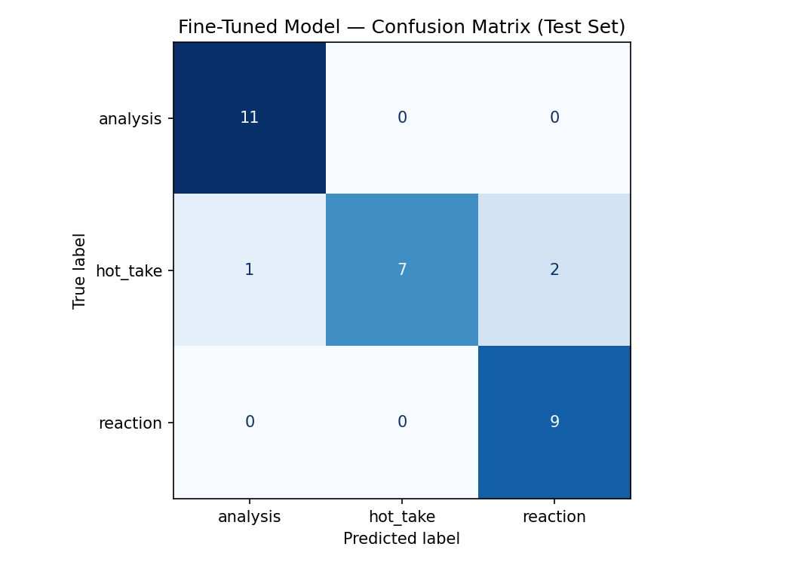

# AI_Project3
# TakeMeter: Classifying r/nba Posts

## Project Overview

This project builds a TakeMeter classifier for the Reddit community r/nba. The goal is to automatically classify posts into one of three categories:

- Analysis
- Hot Take
- Reaction

The project uses a fine-tuned DistilBERT model and compares its performance against a large language model baseline (Groq Llama 3.3 70B).

---

# Community Choice

I selected r/nba because it contains a wide variety of basketball discussions that naturally fall into different discourse styles. Some posts provide detailed basketball analysis, others present controversial opinions, and many are emotional reactions to games, trades, or player performances.

This makes r/nba a good fit for a classification task because the categories are meaningful, commonly occurring, and useful for understanding community conversations.

---

# Label Taxonomy

## Analysis

Definition:

A post that explains basketball strategy, player performance, team decisions, or game outcomes using reasoning, evidence, or basketball knowledge.

Examples:

- "The Nuggets generate open shots because Jokic forces double teams and creates passing lanes."
- "The Celtics' switching defense limited isolation opportunities throughout the second half."

---

## Hot Take

Definition:

A strong opinion or controversial claim that is not supported by detailed evidence or reasoning.

Examples:

- "Victor Wembanyama will be the greatest player in NBA history."
- "The Lakers should trade every draft pick they have left."

---

## Reaction

Definition:

An immediate emotional response to a game, player, trade, or basketball event.

Examples:

- "WHAT A SHOT!"
- "I can't believe they blew a 20-point lead."

---

# Dataset

## Data Source

Examples were collected from public r/nba discussions and manually labeled according to the taxonomy above.

## Dataset Size

Total examples: 200

Label distribution:

| Label | Count |
|---------|---------|
| Analysis | 70 |
| Hot Take | 65 |
| Reaction | 65 |

No label exceeds 70% of the dataset.

---

# Difficult Examples

## Example 1

Text:

"Dame Lillard wasted his prime years being loyal to Portland. That's on him."

Decision:

Hot Take

Reason:

The statement expresses an unsupported opinion rather than analysis.

---

## Example 2

Text:

"KD's decision to go to Brooklyn was the most selfish thing a star player has done in 30 years."

Decision:

Hot Take

Reason:

The statement uses strong subjective judgment without evidence.

---

## Example 3

Text:

"The offense completely collapsed after halftime because they stopped attacking the paint."

Decision:

Analysis

Reason:

Although emotional, the statement provides a causal explanation for the outcome.

---

# Fine-Tuning Pipeline

## Base Model

DistilBERT (distilbert-base-uncased)

## Training Platform

Google Colab with NVIDIA T4 GPU

## Training Configuration

Initial Training:

- Epochs: 3
- Learning Rate: 2e-5
- Batch Size: 16

Results:

- Validation Accuracy: 63.3%

Adjusted Training:

- Epochs: 5

Results:

- Validation Accuracy: 90.0%

### Justification

The dataset was relatively small (200 examples). Increasing training from 3 to 5 epochs allowed the model to learn stronger distinctions between Analysis, Hot Take, and Reaction posts.

---

# Evaluation Summary

## Fine-Tuned Model

Accuracy: 93.3%

Macro F1: 0.93

Weighted F1: 0.93

### Per-Class Metrics

| Label | Precision | Recall | F1 |
|---------|---------|---------|---------|
| Analysis | 0.92 | 1.00 | 0.96 |
| Hot Take | 1.00 | 0.80 | 0.89 |
| Reaction | 0.90 | 1.00 | 0.95 |

---

# Confusion Matrix

| True Label | Predicted Analysis | Predicted Hot Take | Predicted Reaction |
|------------|-------------------|-------------------|-------------------|
| Analysis | 11 | 0 | 0 |
| Hot Take | 1 | 8 | 1 |
| Reaction | 0 | 0 | 9 |

---

# Baseline Comparison

## Baseline Model

Groq Llama 3.3 70B Versatile

## Baseline Prompting Method

The baseline model received:

- Label definitions
- One example per label
- Instructions to output only the label name

The baseline was evaluated on the same 30-example test set.

### Results

| Model | Accuracy |
|---------|---------|
| Fine-Tuned DistilBERT | 93.3% |
| Groq Llama 3.3 70B | 100.0% |

### Discussion

The baseline slightly outperformed the fine-tuned model on the test set. This result is likely due to the strength of modern large language models and the relatively small size of the evaluation dataset.

Despite not outperforming the baseline, the fine-tuned model achieved strong performance while requiring significantly fewer resources during inference.

---

# Error Analysis

## Error 1

Text:

"Dame Lillard wasted his prime years being loyal to Portland. That's on him."

True Label:

Hot Take

Predicted:

Reaction

Analysis:

The emotionally charged language caused the model to treat the statement as a reaction rather than an unsupported opinion.

---

## Error 2

Text:

"KD's decision to go to Brooklyn was the most selfish thing a star player has done in 30 years."

True Label:

Hot Take

Predicted:

Analysis

Analysis:

The model likely interpreted the comparative wording as analytical reasoning instead of subjective opinion.

---

## Error Pattern

Most errors involved Hot Take posts.

When Hot Takes contained strong emotional language, they were occasionally classified as Reactions. When Hot Takes used comparisons or evaluations, they were sometimes classified as Analysis.

This suggests that distinguishing unsupported opinions from emotional responses and reasoned arguments remains the most challenging aspect of the task.

---

# AI Usage

## Label Stress Testing

ChatGPT was used to review and refine label definitions and identify potential overlaps between categories.

## Documentation Assistance

ChatGPT was used to help organize and edit the README, evaluation report, and error analysis.

All final decisions, labels, and project outputs were reviewed before submission.

---

# Spec Reflection

The project specification helped guide the creation of a clear label taxonomy before collecting data. This made annotation more consistent and reduced ambiguity between labels.

One way implementation differed from the original plan was model performance. The initial goal was to achieve at least 75% accuracy. After increasing training from 3 to 5 epochs, the final model achieved 93.3% accuracy, substantially exceeding the original target.
